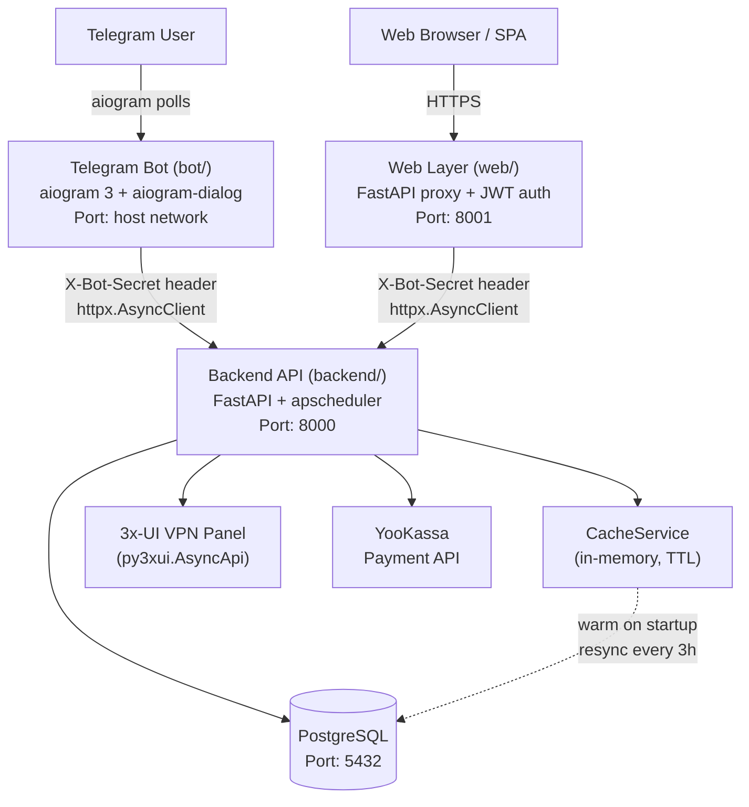

<!-- generated-by: gsd-doc-writer -->
# Architecture

## System Overview

VPN Platform is a three-component monorepo for managing VPN subscriptions. The system provides user-facing interfaces (a Telegram bot and a web SPA) that delegate all business logic to a central FastAPI backend. The backend is the single source of truth: it owns the PostgreSQL database, the in-memory cache, the 3x-UI VPN panel integration, and YooKassa payment processing. Neither the bot nor the web layer may access the database directly or perform VPN panel operations — all such work crosses the HTTP boundary into the backend.

## Component Diagram



## Data Flow

A typical request for a paid VPN key follows this path:

1. **Initiate payment** — The bot or web client calls `POST /api/v1/payments/create` with `tg_id`, `tariff_id`, and operation type (`create_key` or `renew_key`). The backend creates a YooKassa invoice and returns a `confirmation_url`.
2. **User pays** — The user is redirected to the YooKassa payment page outside the platform.
3. **Webhook delivery** — YooKassa sends `POST /api/v1/payments/webhook` to the backend. The backend verifies the source IP against `WEBHOOK_ALLOWED_IPS` and updates the payment record.
4. **Key creation** — On `status == "succeeded"`, `PaymentProcessor` calls `KeyCreation.process()`, which:
   - Creates the VPN client in the 3x-UI panel via `py3xui.AsyncApi.add_client()`
   - Writes the key record to PostgreSQL
   - Updates `CacheService.keys` in memory
5. **Key delivery** — The bot or web client polls `GET /api/v1/payments/{payment_id}/status` and, once succeeded, fetches key details via `GET /api/v1/keys/{email}`.

For free tariffs, steps 2–4 are bypassed: `POST /api/v1/keys/create` handles key creation directly (returns 402 if the tariff is paid).

## Key Abstractions

| Abstraction | File | Purpose |
|---|---|---|
| `BackendAPIClient` | `bot/api/backend_client.py` | Bot-side HTTP client; sends `X-Bot-Secret` on every request |
| `WebBackendClient` | `web/app/api/backend_client.py` | Web-side HTTP client; same contract as `BackendAPIClient` |
| `CacheService` | `backend/services/cache/service.py` | Single entry point for all in-memory cache operations; exposes typed sub-caches (`users`, `keys`, `tariffs`, etc.) |
| `CacheStorage` | `backend/services/cache/storage.py` | Low-level namespace-keyed TTL store; only accessed through `CacheService` |
| `ServiceDataModel` | `backend/services/core/data/service.py` | Facade over `CacheService` + `DataService`; provides unified read access (`users`, `keys`, `servers`, `tariffs`, `payments`, `gifts`, `inbounds`, `stocks`, `referral_links`) |
| `DataService` | `backend/database/service.py` | asyncpg repository container; used only for cache misses or startup loads |
| `KeyCreation` | `backend/services/core/payment/creation_service.py` | Orchestrates VPN key creation after payment success |
| `PaymentProcessor` | `backend/services/core/payment/processor.py` | Validates YooKassa webhooks, updates payment status, triggers `KeyCreation` |
| `KeyRenewal` | `backend/services/core/keys/utils/renewal.py` | Extends key expiry in 3x-UI and database; resets traffic counters |
| `DatabaseSynchronizer` | `backend/services/synchron/database_synchronizer.py` | Full-cycle sync: fetches 3x-UI panel state, compares with cache, restores missing keys, updates traffic |
| `LoadingService` | `backend/services/cache/loader.py` | Populates `CacheService` from PostgreSQL at startup and on manual rebuild |
| `verify_bot_secret` | `backend/app/auth.py` | FastAPI dependency; checks `X-Bot-Secret` header on all backend endpoints |

## Authentication Between Services

| Caller | Mechanism | Detail |
|---|---|---|
| Bot → Backend | `X-Bot-Secret` request header | Shared secret configured in `BOT_SECRET_KEY` env var |
| Web → Backend | `X-Bot-Secret` request header | Same secret; web layer extracts `tg_id` from its own JWT before forwarding |
| Web User → Web | JWT in HttpOnly cookies | `access_token` + `refresh_token`; CSRF protection via `X-CSRF-Token` header |
| Admin → Backend | `X-API-Key` request header | Separate `ADMIN_API_KEY` env var; checked by `verify_api_key` dependency |

The backend does **not** validate user identity independently — it trusts the `tg_id` parameter supplied by the calling service. The web layer is responsible for verifying the JWT before forwarding the `tg_id`.

## Caching Strategy

`CacheService` is an in-memory store with nine typed namespaces: `users`, `keys`, `servers`, `tariffs`, `gifts`, `inbounds`, `payments`, `stocks`, `referral_links`.

**Startup:** `LoadingService.loading()` hydrates all namespaces from PostgreSQL before the first request is served.

**Mutation invalidation:** Every write operation (create key, delete key, renew key, update payment status) updates the relevant cache entry immediately so subsequent reads are cache hits.

**Periodic resync:** A background `apscheduler` job (`backend/background/scheduler.py`) calls `LoadingService.loading()` every three hours to reconcile any drift.

**Manual rebuild:** `POST /api/v1/admin/rebuild-cache` (requires `X-API-Key`) forces an immediate resync.

**Cache key identifiers (critical):**

| Entity | Cache key field |
|---|---|
| `User` | `tg_id` |
| `Key` | `email` (not `id`) |
| `Inbound` | `(server_id, inbound_id)` composite |
| `PaymentModel` | `payment_id` (not `id`) |
| `Server`, `Tariff`, `GiftLink` | `id` |

## Directory Structure Rationale

```
vpn-platform/
├── backend/           # Source of truth: business logic, DB, 3x-UI, payments
│   ├── api/v1/        # FastAPI routers: keys, users, tariffs, payments, admin
│   ├── app/           # FastAPI application entry point, auth, schemas, factories
│   ├── background/    # apscheduler jobs (cache resync every 3h)
│   ├── database/      # asyncpg pool setup, repository classes (DataService)
│   ├── services/
│   │   ├── cache/     # CacheService, CacheStorage, LoadingService
│   │   ├── core/      # Business services: keys, payment, user, tariff, gift, etc.
│   │   ├── analytics/ # Metrics computation (churn, LTV, funnel, referral)
│   │   ├── metrics/   # Prometheus collectors + HTTP /metrics server (port 9101)
│   │   └── synchron/  # DatabaseSynchronizer: 3x-UI ↔ cache/DB reconciliation
│   └── Dockerfile
├── bot/               # Telegram UI layer (aiogram 3 + aiogram-dialog)
│   ├── api/           # BackendAPIClient (httpx), Telegram notification adapter
│   ├── dialogs/       # aiogram-dialog window definitions and templates
│   ├── getters/       # Data getters for dialog windows
│   ├── handlers/      # Start, admin, notification handlers
│   ├── database/      # Auth-only asyncpg repos (login_codes, web_users)
│   └── Dockerfile
├── web/               # SPA proxy + JWT auth layer (FastAPI)
│   ├── app/
│   │   ├── api/       # Route handlers: auth (local), keys/tariffs/payments (proxied)
│   │   ├── core/      # JWT security, CSRF, DB pool, logging
│   │   ├── repositories/ # Auth tables: login_codes, web_users, magic_tokens
│   │   └── services/  # Auth service (JWT generation, code verification)
│   └── Dockerfile
└── docker-compose.yml # Orchestrates postgres, backend, bot, web
```

## External Integrations

**3x-UI VPN Panel** (`py3xui.AsyncApi` via `backend/client.py`): The backend calls `add_client()`, `update_client()`, `delete_client()`, and `get_inbound()` to manage VPN keys on the panel. If the panel is unreachable, key operations return HTTP 502. There is no retry logic.

**YooKassa**: Payment invoices are created via `yookassa.Payment.create()`. Webhook delivery is validated by source IP (`WEBHOOK_ALLOWED_IPS`). Duplicate webhook calls are silently ignored once `status == "succeeded"` has been processed.

**Prometheus metrics**: Backend exposes a `/metrics` endpoint on port `METRICS_PORT` (default `9101`) via a separate aiohttp server. Custom collectors track cache namespace sizes and asyncpg pool statistics.

**Telegram Bot API**: The bot communicates with Telegram via aiogram's long-polling. The backend sends user notifications by calling the Bot API directly using `BOT_TOKEN`.
